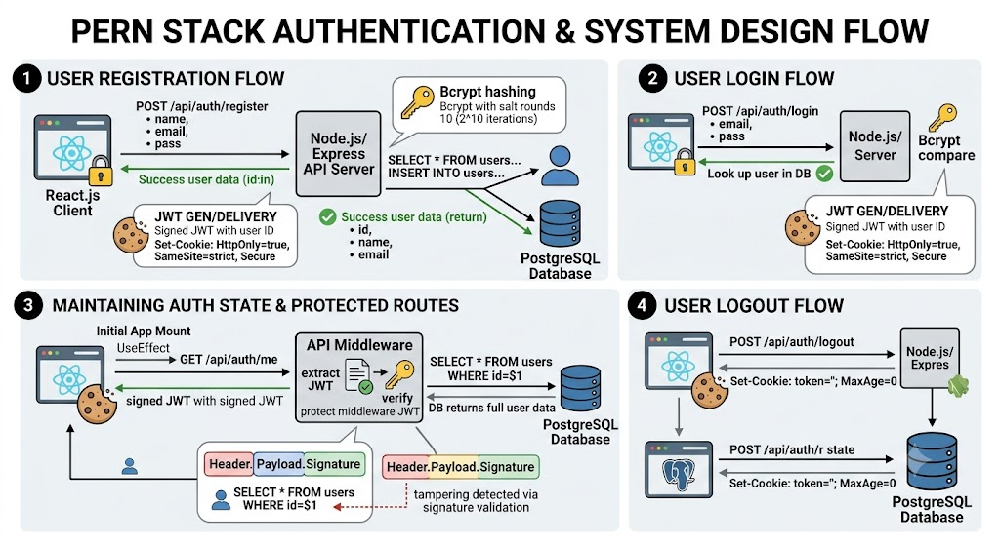

# PERN Stack Authentication System 🛡️

A complete, highly secure authentication flow built on the **PERN stack** (PostgreSQL, Express.js, React, Node.js). This project implements a **stateless authentication mechanism** using JSON Web Tokens (JWT) secured inside **HTTP-only cookies** to protect against common web vulnerabilities, and features robust backend protections including **rate limiting** and **strict input validation**.

## Table of Contents
- [High-Level Architecture](#high-level-architecture)
- [Database Schema Design](#database-schema-design)
- [Authentication Workflows](#authentication-workflows)
  - [Registration Flow](#registration-flow)
  - [Login Flow](#login-flow)
  - [Protected Routes & Maintaining State](#protected-routes--maintaining-state)
  - [Logout Flow](#logout-flow)
- [Security Architecture & Threat Mitigation](#security-architecture--threat-mitigation)

---

## High-Level Architecture

The architecture follows a classic client-server model with a relational database:

* **Frontend (Client)**: React.js application built with Vite and styled using Tailwind CSS. It utilizes React Router for navigation and Axios for HTTP requests.
* **Backend (Server)**: Node.js server using the Express.js framework. It exposes a RESTful API and handles route protection, password hashing, input validation, rate limiting, and cookie management.
* **Database**: PostgreSQL relational database. Connected to the backend via the `pg` (node-postgres) library utilizing a connection pool.

---

## Database Schema Design

The system uses a single `users` table to manage authentication credentials and basic profile information.

| Column | Type | Constraints | Description |
| :--- | :--- | :--- | :--- |
| **`id`** | `SERIAL` | `PRIMARY KEY` | Auto-incrementing, unique identifier for the user. |
| **`name`** | `VARCHAR(100)`| `NOT NULL` | The user's display name. |
| **`email`** | `VARCHAR(100)`| `UNIQUE, NOT NULL` | Primary login identifier. Unique to prevent duplicate accounts. |
| **`password`** | `VARCHAR(255)`| `NOT NULL` | Stores the cryptographically hashed string representing the password. |
| **`created_at`**| `TIMESTAMP` | `DEFAULT CURRENT_TIMESTAMP`| Automatically logs when the user's row was inserted. |

---

## Authentication Workflows

### Registration Flow
1. **Rate Limiting:** The request first passes through a rate limiter, allowing a maximum of 10 auth requests per 15 minutes per IP.
2. **Input Validation:** `express-validator` sanitizes the input (normalizes the email, escapes the name) and enforces strict rules, including a password length limit (6-64 characters) to prevent DoS attacks.
3. **Database Validation:** The backend runs a SQL query (`SELECT * FROM users WHERE email = $1`) to ensure the email isn't already registered.
4. **Password Hashing:** `bcryptjs` hashes the plain-text password using a configurable **salt rounds value** (default 10). This intentionally slows down hash generation to make brute-force attacks computationally expensive.
5. **Database Insertion:** The new user is safely inserted into the database using parameterized queries to protect against SQL Injection.
6. **Token Generation & Delivery:** A JWT is generated containing the user's `id`. The server places this token directly into the browser's cookies using `res.cookie()`, explicitly setting it to be **HTTP-Only** and **SameSite=Strict**.
7. **Frontend Resolution:** The server returns non-sensitive user data. The React app updates the global state and redirects the user to the Home page.

### Login Flow
1. **Rate Limiting & Validation:** Just like registration, the request is rate-limited and the payload is validated (checking for valid email formatting and presence of a password).
2. **Database Lookup:** The server looks up the user by email. If they don't exist, it returns a generic `400 Invalid credentials` error to prevent user enumeration.
3. **Credential Verification:** The server uses `bcryptjs.compare()` to check the inputted password against the stored hash.
4. **Token Issuance:** Upon success, a new JWT is signed and issued to the client via an **HTTP-Only cookie**, starting a new authenticated session.

### Protected Routes & Maintaining State
Because JWT is stateless, the frontend must verify the user is logged in whenever they open or refresh the application.

1. **Axios Configuration:** Axios is configured globally with `withCredentials: true`. This ensures that on every request made to the API, the browser automatically attaches the cookie containing the JWT.
2. **Initial Fetch:** On application mount, a React `useEffect` hook fires an automatic `GET` request to `/api/auth/me`.
3. **The `protect` Middleware:** On the backend, this request passes through a custom middleware:
   * `cookie-parser` extracts the JWT.
   * `jsonwebtoken` verifies its signature and expiration date.
   * If valid, the middleware queries the database using the decoded `id`, fetches the user's data, and attaches it to the `req.user` object.
4. **State Population:** The route sends `req.user` back to the frontend, which populates the React state, bypassing the login screen.

### Logout Flow
1. **Frontend Action:** The user clicks "Logout". Axios sends a `POST` request to `/api/auth/logout`.
2. **Cookie Invalidation:** The server instructs the browser to overwrite the existing `token` cookie with an empty string and an expiration time of 1 millisecond, effectively killing the session on the client side.
3. **Frontend Resolution:** The React state clears the `user` object and redirects to the login screen.

---

## Security Architecture & Threat Mitigation

This application's architecture heavily mitigates vulnerabilities through precise storage and configuration techniques:

* **Brute Force Protection:** Uses `express-rate-limit` to strictly limit the number of times a single IP address can attempt to log in or register within a 15-minute window.
* **Denial of Service (DoS) Prevention:** Enforces a strict maximum password length (64 characters) using `express-validator` to ensure attackers cannot freeze the Node.js event loop by sending massive strings to the CPU-intensive `bcrypt` hashing function.
* **Data Sanitization & Injection Prevention:** Inputs are trimmed, normalized, and escaped. Parameterized queries (`$1`, `$2`) are exclusively used for database interactions to render SQL Injection impossible.
* **Defeating Cross-Site Scripting (XSS):** Storing a JWT in `localStorage` makes it easily accessible to malicious scripts. By using `HttpOnly: true` when configuring the cookie, the browser strictly forbids client-side JavaScript from seeing or accessing the cookie altogether. 
* **Defeating Cross-Site Request Forgery (CSRF):** The cookie options include `sameSite: 'strict'`, explicitly telling the browser to *only* send the cookie if the request originates from the same domain the cookie was set on.
* **Stateless Integrity:** The backend never stores an active session table. It fully trusts the JWT because the signature is mathematically tied to the secret key (`JWT_SECRET`). Any manipulation of the payload will break the signature hash, resulting in the server immediately rejecting the token.
* **Application Stability:** Async route handlers are properly wrapped in `try...catch` blocks to ensure that unexpected database failures do not crash the Express server.